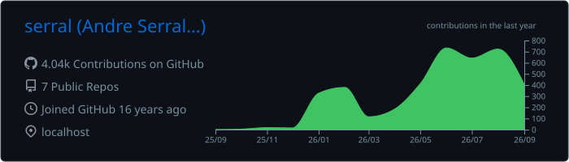
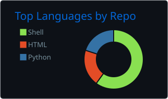
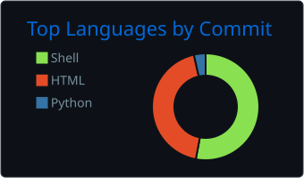
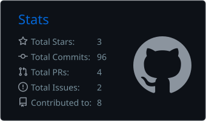

### Hi, I'm Andre Serralheiro

I run security for a digital asset platform: governance, risk, regulatory work, and the unglamorous controls that keep regulated infrastructure standing up. Increasingly that means governing AI systems, not just securing them.

Most of what I build is private, so this profile is a thin slice. What is here leans toward agent tooling and the plumbing around it: skill sets written to be portable across different agent harnesses rather than tied to one, and a knowledge graph I use as durable memory for those agents. Plus homelab and firewall notes.

```txt
leadership       security strategy, GRC, audit, board and regulator reporting
frameworks       ISO 27001/2, ISO 31000, SOC 2, DORA
ai governance    ISO/IEC 42001, ISO/IEC 42005
controls         Secure Controls Framework (SCF), NIST SP 800-53 Rev 5, NIST SP 800-37
domains          digital assets, operational resilience, cloud governance
hands-on         agent tooling, knowledge graphs, homelab, automation
```

<p align="center">
  
</p>
<p align="center">
  
  
  
</p>
